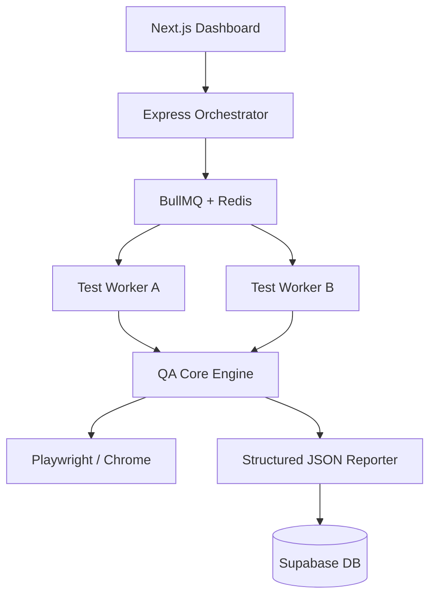

# Self-Healing QA Automation Platform for SaaS Applications

## 🚀 Overview
QA Sentinel is a production-grade, enterprise-level QA automation platform designed to solve the critical challenges of modern SaaS environments: **flaky tests, distributed execution, and multi-tenant isolation.**

Rather than simple script automation, this platform implements a modular "Core-Orchestrator-Worker" architecture, enabling resilient, scalable, and self-healing test suites that mimic real-world system behavior.

---

## 🏗️ Architecture



### Components:
- **`qa-core`**: The modular engine containing the `TestRunner`, `RetryHandler`, and `FlakyDetector`.
- **`backend`**: The command center that manages test suites and triggers distributed runs via BullMQ.
- **`workers`**: Stateless horizontally scalable processes that execute the actual tests.
- **`frontend`**: A high-performance Next.js dashboard for real-time health monitoring and analytics.

---

## ✨ Key Features

### 1. Self-Healing System (Logic-driven)
- **Intelligent Retries**: Uses exponential backoff to recover from transient environment network failures.
- **Flaky Test Tracking**: Automatically identifies unstable tests by comparing attempt history and flags them for engineering review.

### 2. Distributed Test Execution
- **BullMQ Orchestration**: Tests are queued and processed in parallel by multiple worker instances.
- **Status Persistence**: Real-time progress is tracked through Redis and persisted in Supabase for historical analysis.

### 3. SaaS-Oriented Testing Suite
- **Multi-Tenant Isolation**: Automated validation that User A cannot access Tenant B data.
- **Webhook Validation**: Simulation and verification of backend-triggered events (e.g., subscription updates).
- **Chrome Extension (MV3)**: Full automation support for browser companion extensions.

### 4. Enterprise Reporting
- **Live Health Dashboard**: Interactive charts (Recharts) showing execution trends and pass rates.
- **Structured JSON Exports**: Machine-readable reports ready for downstream analytics or ELK integration.

---

## 🛠️ Tech Stack
- **Frontend**: Next.js 14, TailwindCSS, Recharts, Lucide
- **Backend**: Node.js, Express, TypeScript
- **Testing**: Playwright, Jest
- **Infrastructure**: BullMQ (Redis), Docker, Supabase
- **DevOps**: GitHub Actions CI/CD

---

## 🛠️ Engineering Decisions (The "Why")

### 1. Why a Distributed Queue?
In enterprise SaaS, running 1,000+ E2E tests sequentially is a bottleneck. By using **BullMQ + Redis**, we decouple the trigger from the execution, allowing us to spin up 50+ workers to run tests in parallel, reducing CI time from hours to minutes.

### 2. Why a Custom Retry Handler?
Default Playwright retries are often too aggressive. Our `RetryHandler` implements **exponential backoff**, which is more respectful of rate-limited APIs and transient network congestion typical in cloud environments.

### 3. Why Tenant-level Isolation Testing?
The most critical bug in SaaS is a "data leak" where one customer sees another's data. Our platform treats isolation as a first-class citizen with dedicated `isolation` test tags and middleware-level validation simulations.

---

## 🚦 Getting Started

### Prerequisites
- Node.js 20+
- pnpm 8+
- Docker (optional for full stack)

### 1. Clone & Install
```bash
git clone <repo-url>
pnpm install
```

### 2. Local Environment
Create a `.env` in the root:
```env
REDIS_HOST=localhost
REDIS_PORT=6379
SUPABASE_URL=...
SUPABASE_KEY=...
```

### 3. Run Development Services
```bash
# Start Redis first (if using docker)
docker-compose up redis -d

# Run all services in dev mode
pnpm dev
```

### 4. Execute Tests
```bash
# Run all tests
pnpm test

# Run specific E2E suite
pnpm --filter tests exec playwright test
```

---

## 📈 Engineering Excellence Checklist
- [x] **TypeScript Strict Mode**: Zero 'any' policy.
- [x] **Modular Design**: Separation of concerns between execution and reporting.
- [x] **Scalability**: Horizontal worker scaling ready.
- [x] **Observability**: Structured logging and metrics-driven dashboard.

---

## 🧪 Example Test Scenarios
- **Isolation**: Check `tests/e2e/multi-tenant.spec.ts`
- **Flakiness**: Check `qa-core/src/flakyDetector.ts`
- **Orchestration**: Check `backend/src/server.ts`
