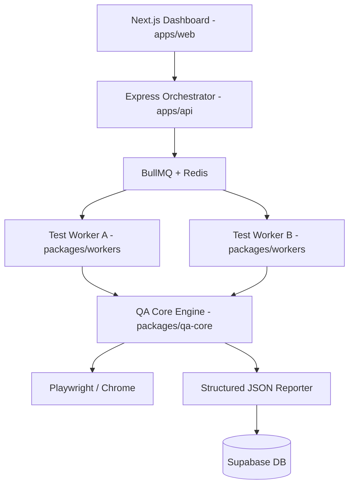

# 🛡️ QA Sentinel Platform

**Full-stack QA Automation Platform** designed to solve the critical challenges of modern SaaS environments: flaky tests, distributed execution, and multi-tenant isolation.

---

## 🏗️ Architecture



---

## 🚀 Features

- **End-to-End Testing**: Native Playwright integration for robust browser automation.
- **CI/CD Pipeline**: GitHub Actions for automated quality gates on every push.
- **Smart Test Insights**: Dashboard stats for Global Pass Rate, Average Duration, and Flaky Detectors.
- **Evidence System**: Automated collection of screenshots, videos, and logs on failure.
- **Self-Healing Logic**: Exponential backoff retries and intelligent flaky test identification.

---

## 🧱 Tech Stack

- **Frontend**: Next.js 14, TailwindCSS, Recharts
- **Backend**: Node.js, Express, BullMQ
- **Testing**: Playwright (E2E), Jest (Unit)
- **Database**: Supabase (PostgreSQL)
- **DevOps**: GitHub Actions, Docker

---

## ▶️ Run Locally

### 1. Installation
```bash
pnpm install
```

### 2. Environment Setup
Create a `.env` in the root with your Supabase credentials.

### 3. Start Development
```bash
# Start all services
pnpm dev

# Run E2E tests
pnpm test:e2e
```

---

## 🧪 Quick Reference (Snippets)

### Orchestrator Mockup
If you need a quick local runner outside the monorepo:
```javascript
const express = require('express');
const { exec } = require('child_process');
const app = express();

app.post('/run-tests', (req, res) => {
  exec('pnpm test:e2e', (err, stdout) => {
    res.json({ status: 'done', raw: stdout });
  });
});
```

### Basic Test Scenario
```typescript
test('homepage loads', async ({ page }) => {
  await page.goto('https://qa-sentinel-platform.vercel.app/');
  await expect(page).toHaveTitle(/QA/);
});
```

### GitHub Pipeline
The platform uses an optimized pnpm workflow located in `.github/workflows/qa.yml`.
