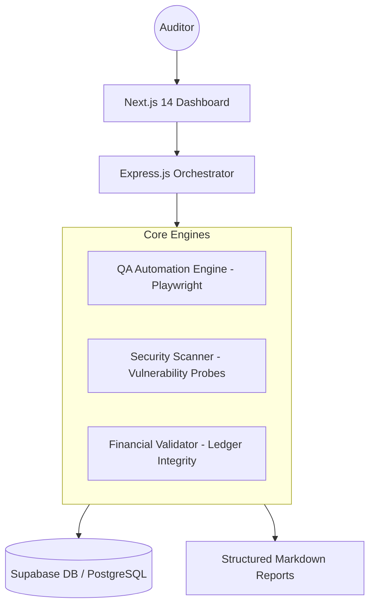

# 🛡️ Sentinel Integrated Auditor

### **AI-powered QA, Security & Financial Validation Platform**

Sentinel is a high-fidelity automation engine designed to bridge the gap between technical quality assurance and business logic integrity. Built for senior-level observability in Fintech, ERP, and high-stakes SaaS environments.

---

## 🏗️ System Architecture

---

## 🚀 Key Modules

### 🧪 QA Automation Engine
- **Atomic Testing**: Individual test execution via Playwright.
- **Self-Healing Logic**: Intelligent retry mechanisms for flaky environment stability.
- **Evidence Collection**: Automated high-resolution screenshots and video recording on failure.

### 🛡️ Security Scanning Engine
- **Proactive Probes**: Real-time crawling to map application topology.
- **Vulnerability Detection**: Automated scanning for missing security headers, XSS vectors, and unauthorized endpoints.
- **Threat Assessment**: Priority-based risk leveling for immediate resolution.

### 💰 Financial Validation Engine
- **Ledger Integrity**: Arithmetic assertions on transaction streams.
- **Arithmetic Reconciliation**: Validation of currency conversions and tax logic.
- **Risk Detector**: Identification of negative balances or arithmetic anomalies in ERP data.

---

## 📊 Observability & Reporting
- **Real-time Execution Logs**: visible processing steps for senior-level transparency.
- **Integrated Health Dashboard**: Consolidated view of QA, Security, and Financial status.
- **Auditor-Ready Reports**: Confidential Markdown summaries generated for stakeholders.

---

## 🧱 Tech Stack
- **Frontend**: Next.js 14 (App Router), TailwindCSS, Recharts, Lucide.
- **Backend**: Node.js, Express, BullMQ (Queue Management).
- **Core**: Playwright, TypeScript, Redis.
- **Data**: Supabase (PostgreSQL), RLS Implementation.

---

## ▶️ Get Started

1. **Install Dependencies**: `pnpm install`
2. **Environment**: Configure `.env` with Supabase/Redis credentials.
3. **Run Platform**: `pnpm dev`
4. **Trigger Audit**: Click "Trigger Financial Audit" on the dashboard.

---

*Sentinel AI: Quality with Integrtiy.*
